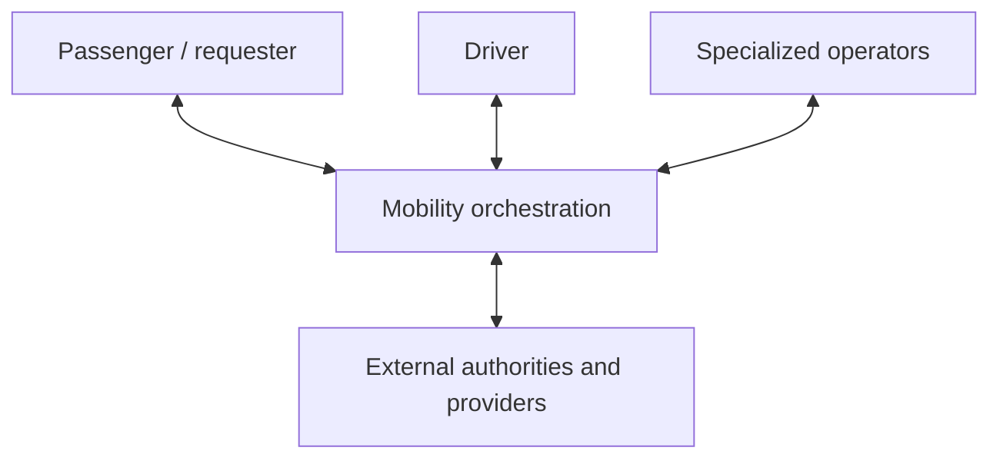

# Uber-Like On-Demand Mobility PRD

Status: product requirements baseline, version 1.

This PRD defines an implementation-independent product harness for an
Uber-like, on-demand private ride. It covers the passenger, driver, operator,
and orchestration planes as one service. It does not describe Uber's private
architecture, prescribe a database design, or assume that Spock can already
express the requirements.

The detailed requirements live in [`prd/`](prd). This file is their
authoritative entry point.

## Grounding and Limits

The PRD is grounded in:

- public Uber and Lyft product documentation for observable marketplace
  behavior;
- California Transportation Network Company material as a concrete regulatory
  baseline;
- CCPA, ADA, WCAG, PCI DSS, and NIST guidance for relevant privacy,
  accessibility, payment-data, and authentication concerns; and
- public Google Maps, Stripe, and Firebase contracts as representative
  external-service constraints.

The complete source ledger records what each source supports and, equally
important, what it does not prove. Public behavior is evidence for the product
problem, not evidence of an internal implementation.

This version uses general United States product behavior and California TNC
rules as its reference-market baseline. A real launch still requires legal,
safety, insurance, tax, labor, accessibility, and operational review for every
market. Market-dependent rules must be versioned rather than hidden as global
constants.

Sources were reviewed on 2026-07-17. Product pages and regulations can change.

## Requirement Language

- **MUST** is required for this product baseline.
- **SHOULD** is expected unless a documented market or safety reason overrides
  it.
- **MAY** is optional.
- **Decision** means this PRD deliberately chooses the behavior.
- **Reference behavior** means an official product source demonstrates it.
- **Regulatory baseline** means an authority requires or materially motivates
  it in the reference market.
- **Provider constraint** means a representative external contract proves the
  integration problem.

Every detailed requirement has a stable prefix:

| Prefix | Plane |
| --- | --- |
| `PAX` | Passenger and requester |
| `DRV` | Driver |
| `MKT` | Marketplace, dispatch, location, and trip |
| `OPS` | Operator, support, safety, privacy, and compliance |
| `FIN` | Pricing, payment, earnings, refunds, and payouts |
| `PLT` | Orchestration, external services, reliability, and audit |
| `ACC` | End-to-end acceptance and launch gates |

## Initial Product Boundary

The first product supports:

- one adult requester who is also the passenger;
- one immediate, private trip;
- one pickup and one destination;
- one standard service class configured for the market;
- one eligible driver using one eligible vehicle;
- one selected electronic passenger payment instrument per operation;
- driver earnings and one selected verified payout instrument per payout;
- post-trip two-sided rating, feedback, and an optional passenger tip;
- passenger, driver, and operator applications;
- live location and realtime status where connectivity permits;
- support, safety escalation, correction, refund, and reconciliation; and
- external identity, screening, maps, payment, payout, and messaging providers,
  plus external emergency coordination where the market offers it.

This first slice deliberately excludes:

- rides requested for another person;
- teen or unaccompanied-minor products;
- pooled rides, multiple stops, advance reservations, or scheduled rides;
- delivery, freight, rentals, public transit, or autonomous vehicles;
- fleet-owner and human-dispatcher products;
- corporate travel, subscriptions, referrals, loyalty, and promotions;
- cash payment;
- proprietary routing, navigation, or dispatch optimization;
- a complete global tax, insurance, payroll, or worker-classification system;
  and
- a chosen vendor, deployment architecture, schema, or Spock surface.

An excluded feature cannot be smuggled into the initial slice through an
exceptional flow. It requires an explicit scope revision.

## Terminology

### Requester

The person who asks the platform to arrange a trip and accepts its commercial
terms.

### Passenger

The person being transported. The requester and passenger are the same person
in this version, but the concepts remain distinct so a later delegated-ride
product has an honest place to attach.

### Driver

The supply-side person who uses an eligible vehicle to fulfill an assigned
trip. This term makes no assumption about employment classification.

### Operator

An authorized internal person acting for passenger or driver support,
marketplace operations, safety, risk, finance, compliance, or platform
administration.

### Platform

The product and services coordinating the marketplace. The platform may decide
within its declared policy, but calling an external system does not make it
authoritative for facts owned by a bank, payment processor, identity provider,
maps provider, regulator, or emergency service.

### Market

A versioned operating context that determines geography, currency, service
class, eligibility, pricing, cancellation, insurance, tax, retention,
accessibility, and reporting policy.

## Product Topology

The diagram is product topology, not deployment architecture. All four planes
participate in the same business lifecycles:

- the passenger authors route intent, request, permitted changes,
  cancellation, rating, and support claims;
- the driver authors availability, offer responses, and permitted trip
  actions;
- operators exercise narrowly granted correction, protection, and
  reconciliation authority; and
- orchestration resolves effective policy, races, external outcomes, and
  role-specific projections.

## Product Goals

- A passenger can understand the offered service, request one intended trip,
  meet the correct driver, follow its progress, pay, and obtain help.
- An eligible driver can choose availability, understand an offer, perform one
  authoritative assignment, understand earnings, and obtain help.
- The marketplace can issue competing offers without creating competing
  assignments or hiding why a request was unfulfilled.
- Quote, final fare, passenger payment, platform amount, driver earning,
  payout, refund, dispute, and correction remain separately explainable.
- Safety and support can act quickly without granting every operator unlimited
  access or silently rewriting history.
- The service converges after retries, disconnections, delayed notifications,
  and duplicated or reordered provider callbacks.
- Each consequential historical decision can be explained using the actor,
  evidence, policy version, provider receipts, and times that applied.

## Product Invariants

These are cross-document requirements:

1. A request has at most one authoritative active assignment.
2. A driver or vehicle cannot execute conflicting trips in this product slice.
3. A client notification or cached screen is never the sole authority for a
   business transition.
4. A coordinate is a timestamped observation with accuracy and provenance, not
   timeless current truth.
5. Location proximity alone cannot prove pickup, trip start, trip completion,
   fault, or no-show.
6. A quote preserves the exact terms and assumptions presented to the
   passenger.
7. Quote, fare, collectible obligation, external collection, earning, and
   payout are not one amount or lifecycle.
8. Retried commands and duplicated callbacks cannot duplicate business
   effects.
9. Corrections append an attributable decision and downstream adjustments;
   they do not erase the prior record.
10. Effective market and policy versions are retained for assignment, pricing,
    cancellation, eligibility, safety, and operator decisions.
11. Precise location, identity, contact, payment, and incident data are
    disclosed only for a current purpose and authorized phase.
12. A consequential provider mutation timeout may leave the outcome unknown;
    a read timeout provides no usable result. Neither proves business failure.
13. Exactly one active market profile resolves for a given scope and business
    time.
14. A correction cannot bypass assignment fences, reopen a terminal physical
    trip, or erase the original outcome.
15. A rating or automated signal is not a safety finding or eligibility
    decision.
16. Changing a payment or payout instrument cannot silently redirect an
    operation already in flight.

## Parallel Lifecycles

The product must not collapse these into one giant trip status:

| Lifecycle | Baseline progression |
| --- | --- |
| Market profile | draft, validated, approved, active, retired |
| Driver eligibility | submitted, under review, eligible, restricted, expired |
| Vehicle eligibility | submitted, under review, eligible, restricted, expired |
| Driver availability | offline, available, reserved, assigned, occupied |
| Trip request | drafted, quoted, searching, assigned, unfulfilled, canceled |
| Dispatch | selecting, offered, responded, expired, assigned, released |
| Trip | approaching, arrived, waiting, in progress, completed, terminated |
| Passenger payment instrument | pending, ready, action required, restricted, removed |
| Passenger payment | ready, provider pending, collected, failed, refunded, disputed |
| Driver payout instrument | pending, ready, action required, restricted, removed |
| Driver compensation | calculated, accrued, adjusted, available, paid, reversed |
| Rating | submitted, revised, withdrawn, moderated, included, excluded |
| Support or safety case | opened, triaged, investigating, acted, resolved, appealed |

Exact transitions and authorities are specified in the detailed documents.

## Detailed PRD

| Document | Authority |
| --- | --- |
| [Passenger and requester](prd/passenger.md) | Account, route intent, quote selection, request, pickup, active trip, receipt, rating, and support requirements |
| [Driver](prd/driver.md) | Onboarding, eligibility, availability, offers, pickup, trip execution, earnings visibility, and driver support |
| [Marketplace and trip](prd/marketplace.md) | Market configuration, dispatch, assignment, location, ETA, trip transitions, cancellation, and no-show |
| [Operations, safety, and compliance](prd/operations.md) | Operator roles, intervention, safety, privacy, accessibility, eligibility review, cases, and audit |
| [Money](prd/money.md) | Quote, fare, payment, platform and driver amounts, refund, dispute, balance, payout, and reconciliation |
| [Platform and reliability](prd/platform.md) | Identity, external providers, realtime delivery, idempotency, degradation, observability, retention, and security |
| [Acceptance and metrics](prd/acceptance.md) | End-to-end scenarios, invariant probes, launch gates, and metric definitions |
| [Source ledger](prd/sources.md) | Evidence, authority type, applicability, and limitations |

Together, these documents are the complete product baseline. A future schema or
language example must state which requirements it covers and must not describe
an omitted requirement as solved.

## Decisions Deliberately Left to Market Profiles

The complete PRD does not invent universal values for:

- driver, vehicle, document, insurance, and screening thresholds;
- quote expiry, offer expiry, pickup grace, and no-show timers;
- cancellation, waiting, toll, tax, surcharge, and accessibility rules;
- whether a market uses exclusive offers, multi-driver offers, or both;
- price calculation and permitted post-trip adjustments;
- data-retention and regulator-reporting periods;
- emergency and safety escalation providers;
- driver payout timing; and
- numeric latency, availability, and recovery targets.

Each value must be configured with provenance, effective time, and market
scope. Launch is blocked until the target market profile supplies and approves
them.
